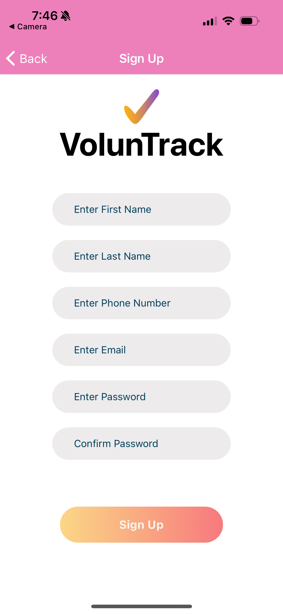
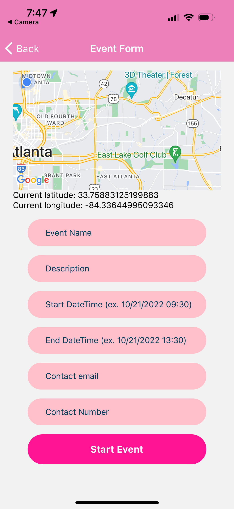
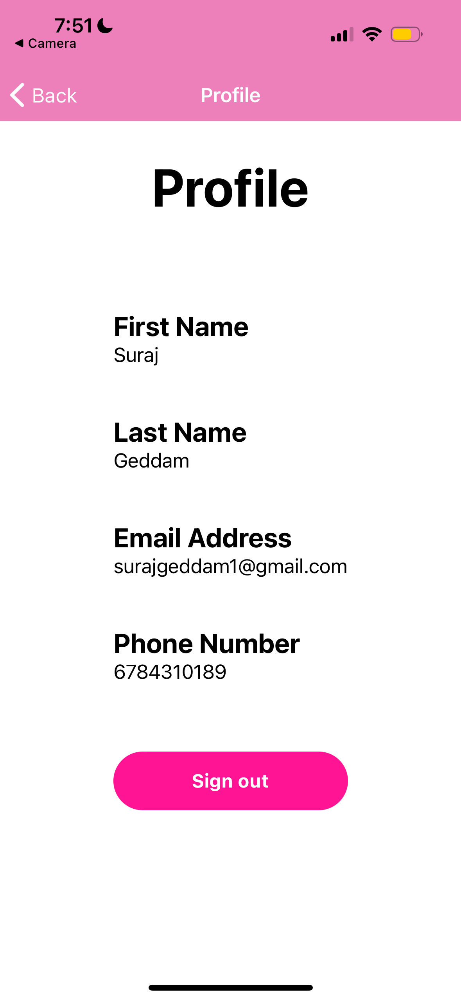
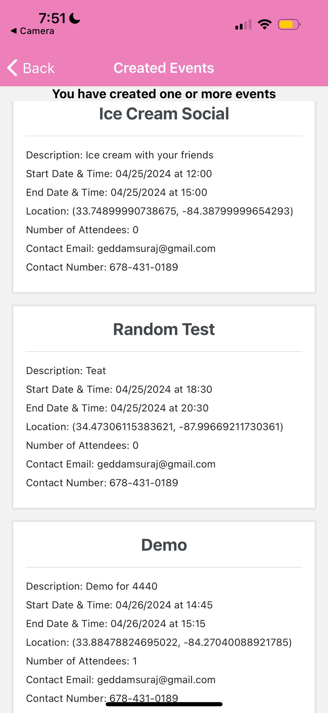
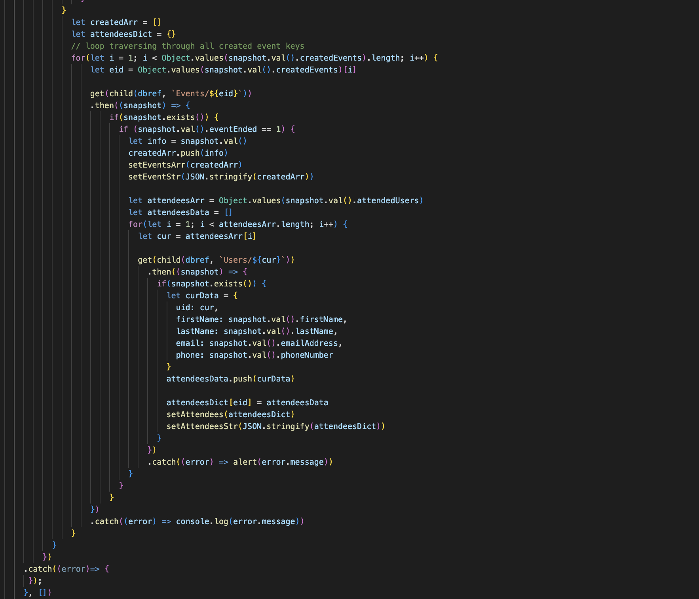
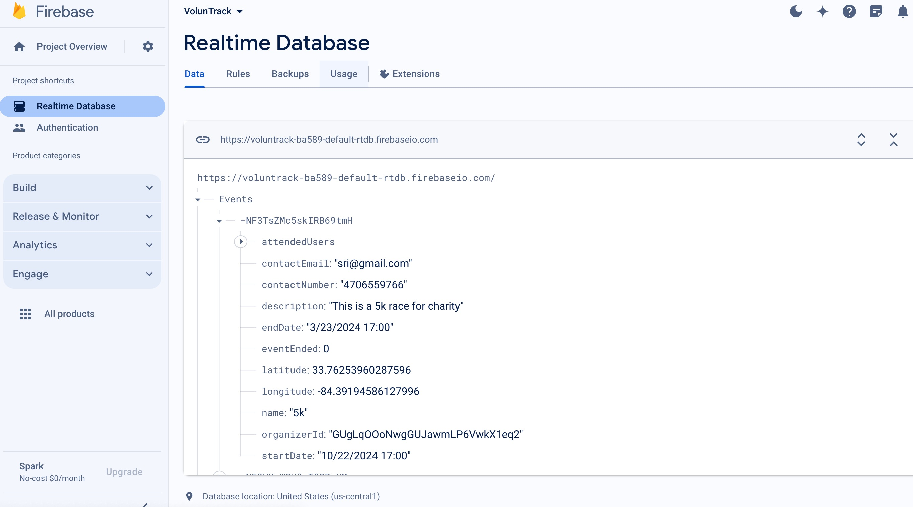
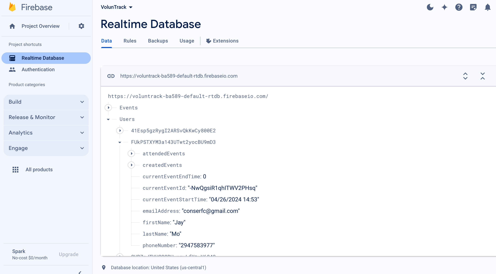

# VolunTrack

Application connecting volunteers and organizers of volunteering events. 
Backend uses Firebase Realtime Database and Node.js. Front End uses React Native. 

Our application streamlines the volunteer process from start to finish. We allow a user to both volunteer and organize events. 
We use QR code technology to automatically track attendance and checked in/out users. All a user has to do is scan in and out, nothing else needed. 
Using this information, we show various metrics about events, including past events that the user volunteered for or organized. 
In addition, we have a volunteer hub; this uses geolocation to find events in the area, as well as connect the user to various volunteers/organizers.

# Getting Started

To get the VolunTrack application up and running on your local machine for development and testing purposes, start by downloading the project as a zip file. Once downloaded, unzip the file into your desired directory. This will extract all the necessary files required for the project.

After extracting the files, open your command line interface and navigate to the project directory. The first step is to install all dependencies needed for the project to function properly. You can do this by running "npm install" within the project directory. This command fetches and installs all the packages defined in the package.json file. All the needed imports for this project are in the package.json file and will be downloaded by running npm install.

Next, you'll need to configure Firebase, which is used as the backend for the application. Start by setting up a new Firebase project in your Firebase console and create a Realtime Database. Firebase environment variables need to be configured next. These include details like API keys, database URLs, and other essential Firebase settings. You can either set these variables in a .env file located in the root of your project directory or hardcode them directly into your configuration files. You can use the firebase environment variables of this project to test out the development.

Once the environment is configured, you can start the development servers. For the backend, which is typically a Node.js server, run "node server.js" to initiate the server. For testing, run "npm install -g expo-cli". For the frontend, which is built with React Native, execute "npm start" to start the Metro bundler. This command prepares and loads your JavaScript code and assets for the application.

To view and test your application on a mobile device, use the Expo Go app, which can be downloaded from the App Store or Google Play. With Expo Go, you can scan the QR code provided by the Metro bundler in your terminal. This will load your application on the device, allowing you to interact with it directly.

This setup process should equip you with a fully functioning development environment for the VolunTrack application, enabling you to proceed with development or testing phases. Remember to check and run any existing automated tests to ensure your setup has been successful and the application behaves as expected.

# Data Preparation and Setup

Firebase Realtime Database Version 9.6.11
Link to Firebase Documentation: https://firebase.google.com/docs
Data is typically generated and managed within the Firebase Realtime Database directly through the application's functionality (e.g., user registration, event creation). For user registration, simply launch the app and sign up for an account with user information of your choice (name, email, phone number, and password). Once you are logged in you can create as many events as you’d like by clicking the “create event” button. You’ll have to again input information of your choice (name, location, duration, description, etc.). 

Example Data Setup/Addition in application:

Example of Application after Data updates:

Code block example of updating data:

Example of Synthetic database:

The data is loaded into the database real time on event and/or user creation.
